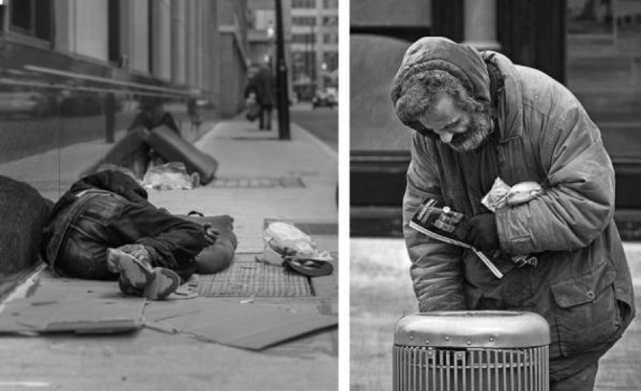
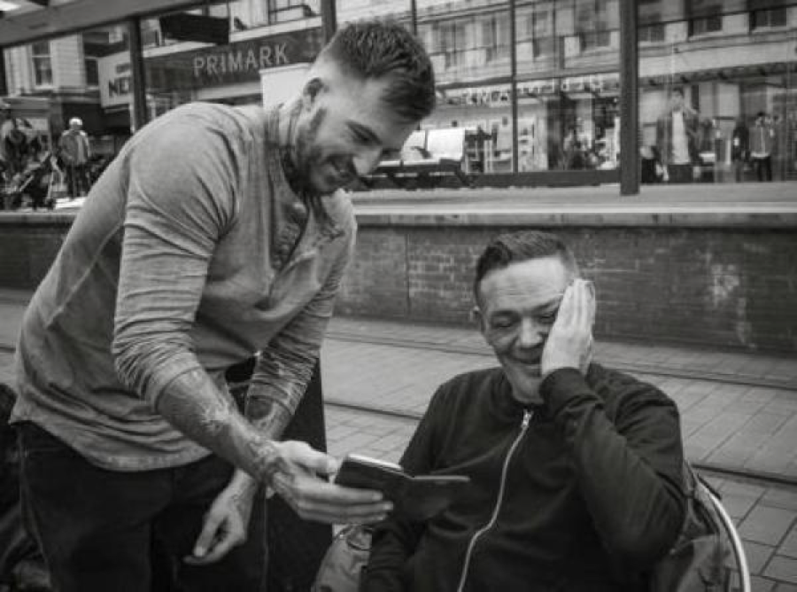
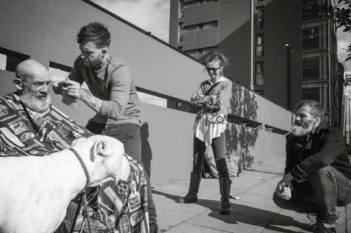

```{r setup, include = FALSE}
rm(list=ls())

packages = c('openxlsx'
             , 'tidyverse', 'data.table'
             , 'visNetwork'
             , 'lmtest', 'sandwich', 'car', 'survey'
             , 'gridExtra', 'stargazer', 'cowplot', 'corrplot'
             , 'knitr', 'webshot'
             , 'png', 'grid')
packages_needed = packages[!packages %in% installed.packages()]
if(length(packages_needed) > 0) install.packages(packages_needed)
lapply(packages, library, character.only = TRUE)

stargazer_type = "latex" #"latex" # change to latex when ready to knit
```

```{r import, include = FALSE}
# Survey Results
# Panel 1
results_raw_panel1 = read.csv("./data/study/MF Framing Pilot - Full Recruitment - Panel 1.csv", stringsAsFactors = FALSE) %>%
  filter(!grepl("Start|Import", StartDate)) %>%
  mutate(panel = 1)
# Panel 2
results_raw_panel2 = read.csv("./data/study/MF Framing Pilot - Full Recruitment - Panel 2.csv", stringsAsFactors = FALSE) %>%
  filter(!grepl("Start|Import", StartDate)) %>%
  mutate(panel = 2)
# Panel 2 - 10 Control Females
results_raw_panel2_10fem = read.csv("./data/study/MF Framing Pilot - Full Recruitment - Panel 2 - 10 Female Control.csv", stringsAsFactors = FALSE) %>%
 filter(!grepl("Start|Import", StartDate)) %>%
 mutate(panel = 2)
# Participant Details
# Panel 1
participant_detail_panel1 = read.csv("./data/study/Prolific Participants - Panel 1.csv", stringsAsFactors = FALSE)
# Panel 2
participant_detail_panel2 = read.csv("./data/study/Prolific Participants - Panel 2.csv", stringsAsFactors = FALSE)
# Panel 2 - 10 Control Females
participant_detail_panel2_10fem = read.csv("./data/study/Prolific Participants - Panel 2 - 10 Female Control.csv", stringsAsFactors = FALSE)
```

```{r deduplicate, include = FALSE}
# Stack panel data (500 obs x 63 vars)
results_stacked = bind_rows(results_raw_panel1
                            , results_raw_panel2
                            , results_raw_panel2_10fem
                            ) %>%
  # Duplicate responses are a product of our multiple data extracts, remove as-is 500 obs x 63 vars)
  distinct(ResponseId, .keep_all= TRUE)
# Identify if the same person filled out the survey >1x
results_ids_dedup = results_stacked %>%
  select(PROLIFIC_PID, ResponseId, StartDate) %>%
  group_by(PROLIFIC_PID) %>%
  summarize(count = n()
            , min_date = min(StartDate))
# Keep only their first submission (500 obs x 64 vars [count will tell us who filled out 2x])
results_dedup = results_stacked %>%
  merge(results_ids_dedup
        , by.x = c("PROLIFIC_PID", "StartDate")
        , by.y = c("PROLIFIC_PID", "min_date")
        , all.x = TRUE) %>%
  filter(!is.na(count))

# Stack participant details (508 obs x 21 vars)
participaipant_detail_stacked =  bind_rows(participant_detail_panel1
                                           , participant_detail_panel2
                                           , participant_detail_panel2_10fem) %>%
  # Duplicate responses are a product of our multiple data extracts, remove as-is (508 obs x 21 vars)
  distinct(session_id, .keep_all= TRUE) %>%
  # Remove vars that will be in results as well (518 obs x 19 vars)
  select(-status, -age)
# Identify if the same person filled out the survey >1x
participaipant_ids_dedup = participaipant_detail_stacked %>%
  select(participant_id, session_id, started_datetime) %>%
  group_by(participant_id) %>%
  summarize(count = n()
            , min_date = min(started_datetime))
# Keep only their first submission (508 obs x 18 vars [count will tell us who filled out 2x])
participaipant_detail_dedup = participaipant_detail_stacked %>%
  merge(participaipant_ids_dedup
        , by.x = c("participant_id", "started_datetime")
        , by.y = c("participant_id", "min_date")
        , all.x = TRUE) %>%
  filter(!is.na(count)) %>% select(-count, -session_id)

# Merge for final dataset (500 obs x 81 vars)
results_full_dedup = merge(results_dedup
                           , participaipant_detail_dedup
                           , by.x = "PROLIFIC_PID"
                           , by.y = "participant_id"
                           , all.x = TRUE)
```

```{r data_cleaning, include = FALSE}
# Adjust all variable names to remove '-' and '.' + lowercase
names(results_full_dedup) = tolower(gsub(x = names(results_full_dedup), pattern = "\\-|\\.", replacement = "_"))

# Discrete variables as factors (manual ordering for plotting)
arm_levels = c("Control", "Purity_Base", "Purity_Extension", "Fairness_Base", "Fairness_Extension")
ideology_levels = c("Very Liberal", "Lean Liberal", "Liberal", "Moderate", "Conservative", "Lean Conservative", "Very Conservative")
response_levels = c("None at all", "A little", "A moderate amount", "A lot", "A great deal")
ubi_group_levels = c("Promoter", "Passive", "Detractor")
ubi_familiarity_levels = c("Extremely familiar", "Very familiar", "Moderately familiar", "Slightly familiar", "Not familiar at all")
recruit_wave_levels = c("Wave1", "Wave2", "Wave3", "Wave4", "Wave5")

results_full = results_full_dedup  %>%
  # Define arms and nodes
  mutate(arm = case_when(grepl('a', fc_b_1, ignore.case = TRUE) ~ "Purity_Base"
                         , grepl('a', fc_c_1, ignore.case = TRUE) ~ "Purity_Extension"
                         , grepl('a', fc_d_1, ignore.case = TRUE) ~ "Fairness_Base"
                         , grepl('a', fc_e_1, ignore.case = TRUE) ~ "Fairness_Extension"
                         , TRUE ~ "Control") %>% factor(levels = arm_levels)
         , node = paste0(arm, "_panel_", panel)
         , arm_level = case_when(grepl('Base', arm) ~ 'Base'
                                 , grepl('Extension', arm) ~ 'Extension'
                                 , TRUE ~ 'Control') %>% factor(levels = c("Control", "Base", "Extension"))
         , arm_story = case_when(grepl('Purity', arm) ~ 'Purity'
                                 , grepl('Fairness', arm) ~ 'Fairness'
                                 , TRUE ~ 'Control') %>% factor(levels = c("Control", "Purity", "Fairness"))
         # Combine reaction vars from different arms
         , purity_q1_self = case_when(grepl('a', fc_b_1, ignore.case = TRUE) ~ fc_b_1
                                      , grepl('a', fc_c_1, ignore.case = TRUE) ~ fc_c_1
                                      , TRUE ~ NA_character_)
         , purity_q2_repulsed = case_when(grepl('a', fc_b_2, ignore.case = TRUE) ~ fc_b_2
                                          , grepl('a', fc_c_2, ignore.case = TRUE) ~ fc_c_2
                                          , TRUE ~ NA_character_)
         , purity_q3_injustice = case_when(grepl('a', fc_b_3, ignore.case = TRUE) ~ fc_b_3
                                           , grepl('a', fc_c_3, ignore.case = TRUE) ~ fc_c_3
                                           , TRUE ~ NA_character_)
         , purity_q4_relieved = case_when(grepl('a', fc_c_4, ignore.case = TRUE) ~ fc_c_4
                                          , TRUE ~ NA_character_)
         , fairness_q1_self = case_when(grepl('a', fc_d_1, ignore.case = TRUE) ~ fc_d_1
                                        , grepl('a', fc_e_1, ignore.case = TRUE) ~ fc_e_1
                                        , TRUE ~ NA_character_)
         , fairness_q2_pain = case_when(grepl('a', fc_d_2, ignore.case = TRUE) ~ fc_d_2
                                        , grepl('a', fc_e_2, ignore.case = TRUE) ~ fc_e_2
                                        , TRUE ~ NA_character_)
         , fairness_q3_injustice = case_when(grepl('a', fc_d_3, ignore.case = TRUE) ~ fc_d_3
                                             , grepl('a', fc_e_3, ignore.case = TRUE) ~ fc_e_3
                                             , TRUE ~ NA_character_)
         , fairness_q4_relieved = case_when(grepl('a', fc_e_4, ignore.case = TRUE) ~ fc_e_4
                                          , TRUE ~ NA_character_)
         # Bin reaction vars
         , purity_q2_repulsed_bin = case_when(is.na(purity_q2_repulsed) ~ NA_real_
                                              , purity_q2_repulsed %in% c("None at all", "A little") ~ 0
                                              , purity_q2_repulsed %in% c("A moderate amount", "A great deal", "A lot") ~ 1
                                              , TRUE ~ NA_real_) %>% factor()
         , purity_q4_relieved_bin = case_when(is.na(purity_q4_relieved) ~ NA_real_
                                              , purity_q4_relieved %in% c("None at all", "A little") ~ 0
                                              , purity_q4_relieved %in% c("A moderate amount", "A great deal", "A lot") ~ 1
                                              , TRUE ~ NA_real_) %>% factor()
         , fairness_q2_pain_bin = case_when(is.na(fairness_q2_pain) ~ NA_real_
                                            , fairness_q2_pain %in% c("None at all", "A little") ~ 0
                                            , fairness_q2_pain %in% c("A moderate amount", "A great deal", "A lot") ~ 1
                                            , TRUE ~ NA_real_) %>% factor()
         , fairness_q4_relieved_bin = case_when(is.na(fairness_q4_relieved) ~ NA_real_
                                                , fairness_q4_relieved %in% c("None at all", "A little") ~ 0
                                                , fairness_q4_relieved %in% c("A moderate amount", "A great deal", "A lot") ~ 1
                                                , TRUE ~ NA_real_) %>% factor()
         , open_text_reaction = q3_fc2
         # Factor variables
         , ideology = factor(polispect, levels = ideology_levels)
         , ideology_bin = case_when(is.na(ideology) ~ "missing"
                                    , ideology == "Very Liberal" ~ "Liberal"
                                    , ideology == "Lean Liberal" ~ "Liberal"
                                    , ideology == "Liberal" ~ "Liberal"
                                    , ideology == "Very Conservative" ~ "Conservative"
                                    , ideology == "Lean Conservative" ~ "Conservative"
                                    , ideology == "Conservative" ~ "Conservative"
                                    , TRUE ~ "Moderate")
         # UBI/Outcome
         , ubi_group = factor(ubi_2_nps_group, levels = ubi_group_levels)
         , ubi_familiarity = factor(ubi_f, levels = ubi_familiarity_levels)
         , ubi_familiarity_bin = case_when(is.na(ubi_f) ~ NA_real_
                                           , ubi_f == "Not familiar at all" ~ 0
                                           , TRUE ~ 1) %>% factor()
         , ubi_number = as.numeric(ubi_2)
         # Recruitment Day blocks
         , recruitment_wave = case_when(is.na(recruitday) ~ "missing"
                                    , recruitday == "T1" ~ "Wave1"
                                    , recruitday == "F" ~ "Wave2"
                                    , recruitday == "SU" ~ "Wave3"
                                    , recruitday == "M" ~ "Wave4"
                                    , recruitday == "T2" ~ "Wave5"
                                    , TRUE ~ "unknown") %>% factor(levels = recruit_wave_levels)  
  )
# Clean = limit to the variables we need
results_clean = results_full %>%
  select(prolific_pid, panel, arm, node, arm_level, arm_story
         , ideology, ideology_bin, age, gender, urban, employment_status, student_status
         , purity_q1_self, purity_q2_repulsed, purity_q3_injustice, purity_q4_relieved
         , fairness_q1_self, fairness_q2_pain, fairness_q3_injustice, fairness_q4_relieved
         , purity_q2_repulsed_bin, purity_q4_relieved_bin, fairness_q2_pain_bin, fairness_q4_relieved_bin
         , open_text_reaction
         , ubi_number, ubi_group, ubi_familiarity, ubi_familiarity_bin, recruitday, recruitment_wave)

# Arm-specific datasets
results_armlibfair = results_clean %>% filter(ideology_bin == 'Liberal' & grepl('Fairness|Control', arm))
results_armlibpure = results_clean %>% filter(ideology_bin == 'Liberal' & grepl('Purity|Control', arm))
results_armconfair = results_clean %>% filter(ideology_bin == 'Conservative' & grepl('Fairness|Control', arm))
results_armconpure = results_clean %>% filter(ideology_bin == 'Conservative' & grepl('Purity|Control', arm))
# Remove moderates for EDA
results_clean_lim = results_clean %>% filter(ideology_bin != "Moderate")
# Controls only for recruitment day test
results_clean_lim_ctrl = results_clean %>% filter(ideology_bin != "Moderate" & grepl('Control', arm))
```

```{r lm_function, include = FALSE}
custom_lm_calcs = function(lm_in, clusters_in){
  # Robust
  vcov_robust = vcovHC(lm_in)
  se_robust = sqrt(diag(vcov_robust))
  # Cluster
  if(length(clusters_in) > 1){
    vcov_cluster = cluster.vcov(lm_in, clusters_in)
    se_cluster = sqrt(diag(vcov_cluster))
  } else {
    vcov_cluster = NA
    se_cluster = NA
  }
  # Output
  lm_out = list(lm = lm_in
                , vcov_robust = vcov_robust
                , se_robust = se_robust
                , vcov_cluster = vcov_cluster
                , se_cluster = se_cluster
  )
  return(lm_out)
}
```

# Introduction  
We make hundreds of decisions each day. We may spend minutes, even hours, considering information to arrive at a decision. But sometimes it's just seconds. A gut response. That response, the baseline opinion anchoring the choices we make, is different for everyone and can be extremely difficult to change.

In the early 2000s, psychologists Jonathan Haidt, Craig Joseph and Jesse Graham proposed a framework to explain why our opinions are different, but also similar. Their theory of **moral foundations** built upon an earlier proposal stating that morality stems from matters of harm, rights and justice. Haidt and his colleagues, however, describe five doctrines, or "foundations" that ultimately influence human decision and behavior: **harm/care**, **fairness/reciprocity**, **ingroup/loyalty**, **authority/respect** and **purity/sanctity**. _@haidt2007morality _  

Moral foundations theory has often been applied to studies of political science, differences between cultures and intuitive ethics. They offer a concrete framework for understanding the morals that unite and divide us all. In his book, _The Righteous Mind (2012)_, Haidt explored how the five foundations are used by both conservatives and liberals to support moral questions in the political realm. Those leaning more to the political left are guided predominantly by harm/care and fairness/reciprocity, while those leaning right rely on all five foundations. It follows then that conservatives weigh the first two foundations less when making decisions or judgments; harm/care and fairness/reciprocity comprise one-fifth of the equation, respectively, instead of one-half.  

Perhaps in a perfect world, every voter would decide on issues and candidates based on thorough research of policy and practice, but we know this is not the case. In the 2016 United States presidential election we experienced both sides trying to manipulate voter opinion by playing to emotions and the moral foundations that ground them. The Republican party paid millions of dollars to Cambridge Analytica, who leveraged large scale analytics and Facebook ads to target voters' emotions because "content works well if it makes you very emotional." _@price_2017; @ghosh2018 _ Democrats, on the other hand, battled to make their candidate seem more "likeable", which is arguably not the most critical characteristic of a successful leader, and certainly not the only one. _@newton-small2016 _ Haidt would likely agree that these are examples of political organizations attempting to trigger certain moral foundations to "get your vote, your money, or your time." But is this possible?  

Perhaps in a perfect world, every voter would decide on issues and candidates based on thorough research of policy and practice, but we know this is not the case. For example, in 2016 a large campaign analytics company leveraged bid data to target voters' emotions in the United States because "content works well if it makes you very emotional." _@price2017 _;  _@ghosh2018 _ In that same election, we saw a candidate with deep political experience fighting to seem more "likeable". These events show the influence of emotions and the moral foundations that ground them in driving voter opinions, and ultimately, decisions. Haidt would likely agree these are examples of political organizations attempting to trigger certain moral foundations to "get your vote, your money, or your time." But is this possible?

# Background & Motivation  

Online marketing campaigns and social media has increased the specificity with which political campaigns--or anyone--can target individuals with persuasion (or manipulation?) tactics. A study in 2014 by Martin Day, Susan Fiske, Emily Downing and Thomas Trail examined the effects of Haidt's moral foundations on the opinions of liberals and conservatives, for what the researchers described as "pro-attitudinal and counter-attitudinal" positions on issues. _@day2014moral _  

Day et al executed two experiments to test the effects of moral foundation-based "frames". A frame can take several forms--stories, pictures, newspaper articles, to name a few. In Day's studies, the participants were shown a number of morally framed stances. For example, a "morally framed conservative stance" on immigration which targets the fairness foundation reads, "It is only fair to preserve the rights of long-term citizens ahead of recent immigrants." _@day2014moral _

Both studies supported the hypothesis that an individual's political attitude is bolstered by relevant moral foundation-based frames, however only one study supported that the same frames may persuade a subject to shift his or her opinion away from one side of the political spectrum.   

Another study that played a key role in defining this experiment was a paper by Lene Aaroe, Michael Bang Petersen and Kevin Arceneaux on "Why and How Individual Differences in Disgust Sensitivity Underlie Opposition to Immigration". _@arceneaux2017 _ The subjects are tested on their support for immigration after their disgust response is triggered. This study finds some causal factors that influence political attitudes outside of one's conscious awareness and confirms that leveraging framing as a treatment lever does produce an observable effect on subjects.   

To build on the conclusions of Day et al's work, we designed a study to measure the effect of moral foundation-based frame on opinions on Universal Basic Income (UBI). UBI is a topic for which political conservatives and liberals are generally accepted to have opposing views. To maximize resources available, we decided to only test two of the moral foundations: purity/sanctity and fairness/reciprocity.

# Experimental Design  

## Hypothesis  

Can appealing to one or more of the moral foundations modify how an individual feels about a topic, particularly those which are politically-relevant? Assume that an opinion can be represented as a point on a line between "favor" and "oppose". With this assumption we can test the following hypothesis: **framing a politically divisive topic with a targeted moral foundation can move a subject's opinion away from its original point on the line, in either direction.**  

## Treatment  

To test this hypothesis, we had to define the frames for our experiment. A "frame" is a common concept within the study of social sciences. In his paper, _Framing: Toward Clarification of a Fractured Paradigm_, author Robert Entman described framing as the "transfer (or communication) of information from one location... to [human] consciousness." _@Entman1993 _ We know that information can be bestowed upon the human consciousness in many ways: a speech, a book, a news article, or even pictures can act as frames influencing our interpretation and the resulting influence of information.  

We proceeded to develop frames in the form of written vignettes with one to two related images. Developing our own frames gave us ultimate control over how well the story triggered the desired moral foundation. Additionally, we wanted to test the effects of framing the foundation in both a positive and negative light. We did this by creating two possible endings to the treatment vignette: one in which the conflict triggering the foundation was left unresolved (the **base** treatment), the other with a positive resolution to that same conflict (the **extension** treatment).    

As is described in greater detail in the Procedure section of this report, we scoped our experiment to test the effect of two moral foundations: fairness/reciprocity and purity/sanctity. Thus, we wrote two vignettes, each with two possible endings (resolution or non-resolution). Refer to the appendix for presentations of the treatment vignettes used in our experiment.  

As is evident when reading Entman's description of a frame, it is a somewhat "fuzzy" concept. As such, it was critical to conduct pilot surveys to confirm that the vignettes were triggering the intended foundation. Overall, the results supported that our frames were successfully evoking the appropriate moral foundation, with some variability in the vignette designed to hit on the fairness/reciprocity frame. However, we determined the results were strong enough to move forward with the treatments, as originally designed. For complete results of the pilot testing, refer to _\autoref{tab:prelimmodel}_.  

## Distribution  

_[Not Updated as of Dec 13 @ 3 PM]_

Given the numerous arms of our proposed study (described in detail in Experiment Design: Procedure), we required 150 participants at an absolute minimum. We determined an online platform was the best available route to gather a sufficient random sample of this size given time, budget and geographic constraints. We recruited a total sample size of 505 adults living in the United States using Prolific, an online platform that connects researchers with participants around the world.

Prolific also facilitated blocking to obtain an equal distribution of participants who identified as being either politically conservative or politically liberal. This was performed by selecting one of the prescreened characteristics for subjects who indicating their ideological identification within the US Political Spectrum.

Of the 505 subjects who participated in the study, all but three from the conservative block and one from the liberal block completed all required tasks. Those who did not complete all tasks were automatically replaced by Prolific. Those participants received \$0.70 as compensation for participating in the study, and Prolific received \$0.30.

Our study specifically targeted subjects who identified as either politically liberal or conservative. There is less available research on the moral groundings of political moderates, thus we did not target this group for our experiment.

The subject pool comprised of XX (x%) .. Figure 1 shows further detail on the political identifications of the participants. XX (x%) identified as female, XX (x%) identified as male.

Collection of participants took place over several days. We had limited funds available with which to execute the experiment, so we agreed to gather 100 conservative and 100 liberal participants in the first wave, conduct initial covariate balance checks, and proceed with additional participants as deemed necessary. 

Overall, we had X waves. Table 1 provides additional information on each wave. Overall, we gathered an effective sample size for analysis of X participants: xx. stats.

We have a high level of confidence in the randomization of our effective participant population due to the use of Prolific to gather subjects. Qualtrics was leveraged to randomly assign subjects to control or one of the 4 other treatment conditions so there would be an even distribution across all 5 survey arms. We noted that the temporal nature of the waves may affect responses, so this was noted as a covariate to be included during our analysis.

```{r exploratory_demographics, echo = FALSE, fig.height = 8, fig.width = 8, fig.align="center", fig.cap="Demographics"}

# Ideology
plot_ideology = ggplot() +
  geom_bar(data = results_clean_lim %>%  group_by(ideology) %>% 
             summarise(Count = n()) %>% rename("Ideology" = ideology)
           , aes(x = Ideology, y = Count, fill = Ideology), stat = "identity") +
  scale_fill_brewer(type = "div", palette = 5, direction = -1, aesthetics = "fill") +
  theme_bw() +
  theme(axis.text.x = element_text(angle = 45, hjust = 1)) +
  theme(legend.position = "left", axis.text.x=element_blank(), legend.text=element_text(size = 8))

# Backbone ggplot object
grpstackbar_plot = ggplot() +
  facet_grid( ~ ideology_bin) +
  scale_fill_brewer(type = "div", palette = 5, direction = -1, aesthetics = "fill") +
  theme_bw() +
  theme(axis.text.x = element_text(angle = 45, hjust = 1))
# Age
plot_age = grpstackbar_plot +
  geom_bar(data = results_clean_lim %>% group_by(age, ideology, ideology_bin) %>% 
             summarise(Count = n()) %>% rename("Ideology" = ideology, "Age" = age)
           , aes(x = Age, y = Count, fill = Ideology), stat = "identity", show.legend = FALSE)
# Gender
plot_gender = grpstackbar_plot +
  geom_bar(data = results_clean_lim %>% group_by(gender, ideology, ideology_bin) %>% 
             summarise(Count = n()) %>% rename("Ideology" = ideology, "Gender" = gender)
           , aes(x = Gender, y = Count, fill = Ideology), stat = "identity", show.legend = FALSE)
# Urban
plot_urban = grpstackbar_plot +
  geom_bar(data = results_clean_lim %>% group_by(urban, ideology, ideology_bin) %>% 
             summarise(Count = n()) %>% rename("Ideology" = ideology, "Urban" = urban)
           , aes(x = Urban, y = Count, fill = Ideology), stat = "identity", show.legend = FALSE)

# Histogram of familiarity
plot_familiarity = grpstackbar_plot +
  geom_bar(data = results_clean_lim %>% filter(!is.na(ubi_familiarity)) %>% 
                            group_by(ubi_familiarity, ideology, ideology_bin) %>% 
                            summarise(Count = n()) %>%
                            rename("Ideology" = ideology, "UBI Familiarity" = ubi_familiarity)
       , aes(x = `UBI Familiarity`, y = Count, fill = Ideology), stat="identity", show.legend = FALSE)

# PLOT
grid.arrange(plot_ideology, plot_gender
             , plot_age, plot_familiarity
             , nrow = 2)
```

```{r exploratory_reactions, echo = FALSE, fig.height = 8, fig.width = 8, fig.align="center", fig.cap="Reactions"}
results_response = results_clean_lim %>%
  mutate("See myself" = case_when(arm_story == "Purity" ~ purity_q1_self, TRUE ~ fairness_q1_self)
         , "Felt repulsed/pain" = case_when(arm_story == "Purity" ~ purity_q2_repulsed, TRUE ~ fairness_q2_pain) 
         , "Felt relieved" = case_when(arm_story == "Purity" ~ purity_q4_relieved, TRUE ~ fairness_q4_relieved)) %>% 
  select(ideology_bin, arm_level, arm_story, `See myself`, `Felt repulsed/pain`, `Felt relieved`) %>%
  gather(prompt, value, -ideology_bin, -arm_level, -arm_story) %>%
  filter(!is.na(value)) %>%
  group_by(ideology_bin, arm_level, arm_story, prompt, value) %>%
  summarise(count = n()) %>%
  mutate(Response = factor(value, levels = response_levels)) %>%
  group_by(ideology_bin, arm_level, arm_story, prompt) %>%
  mutate(count_total_cohort = sum(count)
         , Share = count/count_total_cohort
         , Prompt = factor(prompt, levels = c("See myself", "Felt repulsed/pain", "Felt relieved")))
  
ggplot(data = results_response
       , aes(x = Prompt, y = Response, fill = Share)) +
  geom_tile() +
  facet_grid(rows = vars(arm_story, arm_level)
             , cols = vars(ideology_bin)) +
  scale_fill_distiller(direction = 1, palette = 2) +
  theme_bw() +
  theme(axis.text.x = element_text(angle = 45, hjust = 1)
        , legend.position = "none")
```

\newpage

## Procedure  

We developed two treatment options for both moral foundations included in our experiment, executed via a written story with accompanying photographs (for further detail, see Materials section).   

All subjects assigned to treatment would read a "base" story designed to trigger either the purity/sanctity or fairness/reciprocity foundations. Some subjects within the treatment group were selected, via random assignment, to read an extension to the base story which offered a positive resolution to moral conflict from the base. The intended effect of the extension was to specifically trigger the participant's "pro-attitudinal..  

We implemented a timer on the treatment pages of the survey requiring participants to stay on the page for at least 15-20 seconds, depending on the length of the frame. This was done to prevent subjects from clicking through the pages without adequate time to read and digest the frame.

Figure X offers a detailed description of the four treatment arms and control arm for the experiment. Participants were randomly assigned to one of the five arms using five-way random sampling without replacement executed within the Qualtrics survey platform.

After navigating through treatment or control, the subjects were asked to share their degree of support for the concept of UBI on an eleven point likert scale from zero to ten.

All participants answered the following demographic questions before concluding the survey: age, gender, urbanicity and political orientation. The political orientation demographic was requested to confirm successful blocking executed via Prolific. Subjects who self-identified as moderates in the survey were dropped from the analysis.   

Participants in the pilot study and select waves were also asked about their reactions to the frames to assess whether they triggered the intended moral foundation. The pilot was executed with a small group of X participants to test the strength of the stories with regards to hitting on the intended moral foundations and find whether the study was receiving a balanced mix of participants while examining different covariates.  

See _\autoref{fig:study_flowchart}_ for detailed flowchart of study design.  

## Modifications  

Our first wave of participants comprised of 100 conservatives and 100 liberals split evenly amongst the 5 arms of the experiment (roughly 20 participants per arm, per block). We conducted a preliminary analysis to evaluate balance among possible covariates (e.g. gender, age), effect size and directionality. We noted that there was an imbalance of gender in the conservative block and proceeded to recruit additional female conservatives. This wave was consequently excluded from analysis due to lack of randomized collection (i.e. participants were targeted rather than randomly recruited).

We noted the greatest movement amongst the conservatives being treated with the purity frame. In general, the liberal block had high support of the concept of UBI, which decreased the likelihood that we would observe a measured change in attitude, particularly given our limited sample size. The conservatives generally had lower support of UBI (without treatment) and thus had more room for change in response to treatment.

In a world with limitless funds, we would have been able to collect enough participants to supply sufficient power to each arm of the study, however this was not the case. Thus, we dedicated our remaining resources to the treatment arm showing promise of a statistically significant effect.  

# Analysis of Results  

## Data  

Given our "waves" approach to data collection, we wanted to ensure the wave/day blocking did not introduce an effect on our results, such as weekdays, weekends, or time of time affecting baseline opinions of UBI. \autoref{tab:wavestratmodel} in the **Appendix** further details this test.  We found that the waves did not have a meaningful effect and as such moved forward withanalyzing the pooled data.  

## Models  

```{r model_all_arms, echo = FALSE, results='asis'}
model_libfair = custom_lm_calcs(lm_in = lm(ubi_number ~ arm_level, data = results_armlibfair), clusters_in = NA)
model_libpure = custom_lm_calcs(lm_in = lm(ubi_number ~ arm_level, data = results_armlibpure), clusters_in = NA)
model_confair = custom_lm_calcs(lm_in = lm(ubi_number ~ arm_level, data = results_armconfair), clusters_in = NA)
model_conpure = custom_lm_calcs(lm_in = lm(ubi_number ~ arm_level, data = results_armconpure), clusters_in = NA)

stargazer(model_libfair$lm, model_libpure$lm
          , model_confair$lm, model_conpure$lm
          , se = list(model_libfair$se_robust, model_libpure$se_robust
                      , model_confair$se_robust, model_conpure$se_robust)
          , report           = ('v*c*sp')
          , header           = F
          , title            = "By Arm"
          , dep.var.caption  = "Four Study Arms"
          , dep.var.labels   = "UBI Ranking"
          , column.labels    = c("Lib + Fair", "Lib + Pure"
                                 , "Con + Fair", "Con + Pure")
          , covariate.labels = c("Base Only Treatment", "Base + Extension Treatment")
          , notes            = c("HC Robust Standard Errors"
                                 , "Lib = Liberal | Con = Conservative"
                                 , "Pure = Purity Frame | Fair = Fairness Frame")
          , font.size        = "small"
          , column.sep.width = "1pt"
          , label            = "tab:allarmsmodel"
          , type             = stargazer_type
)
```

_\autoref{tab:allarmsmodel})_ presents the results of all treatments collected. Note that while our survey design included an approach to test all combinations of political ideology (`ideology`; liberal/conservative), moral foundation (`arm_story`; purity/fairness), and directionality (`arm_level`; base/extension) we did not hypothesize that a factorial design would be appropriate and therefore did not test the treatments as such. Instead, we hypothesized that specific moral foundations would resonate differently among participants of different ideologies, and therefore tested the effect of changes in directionality (`ubi_number ~ arm_level`) within each of the four arms (comprised of combinations of ideology and moral foundation).  

The results demonstrate that the extension of the Purity foundation story, when shown to the Conservative participants, may positively affect participant opinions of UBI. This finding fits our prior expectation, which motivated us to focus on this arm as we gathered additional data. The Conservative participants had both a lower baseline opinion of UBI (`round(model_conpure$lm$coefficients["(Intercept)"],2)`), which means that upward influence was possible, and the Purity story was expected to resonate the most with Conservatives (according to existing research). Therefore, the Extension (positive) treatment of the Purity story would logically leave Conservatives who would otherwise, on average, perhaps be skeptical of UBI, feeling optimistic and focused on purity - making them more amenable to helping.  

The Base (negative) implementation of purity showed only minimal upward influence but was not statistically significant. Our prior hypothesis was that negative use of a moral foundation may not be internalized consistently among participants: while some may react to an "impure" scenario of homelessness and believe that a social program like UBI would enable more impure behavior, others may see UBI as a remedy for that homelessness.  

Liberal baseline opinions of UBI were so high to begin with that our hypothesized influence of some treatments were not meaningful - all coefficients of treatments for Liberals are minimally negative and not statistically significant. The value in this finding could be further explored with additional studies.  

\newpage

```{r model_conpure_interactions, echo = FALSE, results='asis'}

# Gender
model_conpure_gender = custom_lm_calcs(lm_in = lm(ubi_number ~ arm_level + gender
                                               , data = results_armconpure)
                                        , clusters_in = NA)
# Familiarity
model_conpure_familiarity = custom_lm_calcs(lm_in = lm(ubi_number ~ arm_level + ubi_familiarity_bin
                                                    , data = results_armconpure)
                                             , clusters_in = NA)

# Reaction (need to re-factor reactions first)
results_armconpure_reaction = results_armconpure %>%
  mutate(purity_q2_repulsed_bin_f = case_when(is.na(purity_q2_repulsed_bin) ~ 0
                                              , TRUE ~ as.numeric(as.character(purity_q2_repulsed_bin))) %>% factor()
         , purity_q4_relieved_bin_f = case_when(is.na(purity_q4_relieved_bin) ~ 0
                                                , TRUE ~ as.numeric(as.character(purity_q4_relieved_bin))) %>% factor()
         )
model_conpure_reaction = custom_lm_calcs(lm_in = lm(ubi_number ~ arm_level + purity_q2_repulsed_bin_f * purity_q4_relieved_bin_f
                                                    , data = results_armconpure_reaction)
                                         , clusters_in = NA)

stargazer(model_conpure$lm
          , model_conpure_gender$lm
          , model_conpure_familiarity$lm
          , model_conpure_reaction$lm
          , se = list(model_conpure$se_robust
                      , model_conpure_gender$se_robust
                      , model_conpure_familiarity$se_robust
                      , model_conpure_reaction$se_robust
          )
          , report           = ('v*c*sp')
          , header           = F
          , title            = "Conservative + Purity Treatment Arm Interaction Specifications"
          , dep.var.caption  = "Con + Pure Arm Only"
          , dep.var.labels   = "UBI Ranking"
          , column.labels    = c("No Covariates", "Gender", "UBI Familiarity", "Reaction") 
          , covariate.labels = c("Base Only Treatment", "Base + Extension Treatment"
                                 , "Male", "Familiar w/ UBI"
                                 , "Repulsed", "Relieved", "Repulsed then Relieved")
          , notes            = c("HC Robust Standard Errors"
                                 , "Lib = Liberal | Con = Conservative"
                                 , "Pure = Purity Frame | Fair = Fairness Frame")
          , font.size        = "small"
          , column.sep.width = "1pt"
          , label            = "tab:covariatesmodel"
          , type             = stargazer_type
)
```

Given our focus on the Conservative Purity arms, we also tested covariate specifications to test if our measured average treatment effect was being driven by any baseline differences between arms or if, in fact, our treatments were leading to reactions that fueled changes of opinion. _\autoref{tab:covariatesmodel}_ details these results.  

Gender has a significant difference at baseline (`ubi_number ~ arm_level + gender`): men had, on average, a >1 point higher baseline opinion of UBI than women. Interestingly, however, the average effect is still consistent even when accounting for this difference.  

Being familiar with UBI was associated with a slightly lower, though statistically insignificant, conservative baseline opinion of UBI (`ubi_number ~ arm_level + ubi_familiarity_bin`). Our prior hypothesis was that familiarity with UBI may "entrench" participants and make them less amenable to a shift in opinion when compared to participants encountering the policy for the first time, but we find an almost identical treatment effect even when controlling for this difference.  

Given that neither of our hypothesized baseline differences from gender of UBI familiarity had a meaningful effect on the outcome, we then tested a specification using participants reactions as covariates to identify if those who reported to have experienced the reactions we intended from the treatments were more likely to drive the effect we hypothesized from that reaction. The strongest coefficient was of that for participants who reported feeling repulsed by the base portion of the story and then relieved by the extension portion. This is precisely the effect we were intending and, with a coefficient of 2.163, is a large effect relative to all other treatments. Participants that reported being repulsed without then feeling relieved and participants only reporting feeling relieved were associated with outcome measures directionally in line with our hypotheses (repulsed causes decrease, relieved causes increase) but were not statistically significant.  

\newpage

# Conclusion  

## Discussion

Our experiment demonstrates that it may be possible to affect attitudes toward political topics through exposure to moral foundations. As has been noted in this report, the applications of this type of finding are widespread and underpin many forms of persuasion, argumentation, and marketing currently employed in various domains: politics, advertising, etc. However, the generalizability of this finding is questionable and will be further detailed in the Limitations section below.   

## Limitations

Isolating effect attributable to a specific moral foundation is not feasible
Any stimuli can trigger multiple moral foundations
In effect, this experiment only tests the effectiveness of our stimuli in effecting these outcomes, because any subsequent adaptation of this message/imagery could contain nuanced differences that could affect results
In practical terms, while this finding may seem to be immediately applicable in analogous fields (e.g. a politician proposing universal healthcare may see an opportunity to frame their arguments in purity foundations to persuade otherwise reticent conservative constituents) the generalizability of this finding to other topics and stimuli is beyond the scope of this project. 
Many stimuli and targets would need to be tested while controlling for nuances between stimuli
 
\pagebreak

# Appendices {-}

## Appendix A: Declaration of Conflicting Interests {-}

To the best of their knowledge, the authors have no potential conflicts of interest with respect to the research, distribution of survey, and authorship of this paper.

## Appendix B: Funding {-}

The authors received $500 in financial support from the University of California, Berkeley which was leveraged to pay survey-takers through the Prolific platform and satisfy the statistical power requirements.  

In addition, the authors put in $25 out of their own personal income to increase the statistical power of the results and balance the number of subjects between liberals and conservatives.  

\newpage
## Appendix C: Study Flowchart {-}

```{r flowchart, echo = FALSE, fig.height = 8, fig.width=4.8, fig.align="center", fig.cap="\\label{fig:study_flowchart} Study Flowchart"}
flowchart_img = readPNG("images/flowchart.png")
grid.raster(flowchart_img)
```
\newpage
## Appendix D: Data Dictionary {-}

| Variable Name | Variable | Values |
| :---- | :-------- | :-------- | 
| `prolific_pid` | User ID | 24-digit alphanumeric |
| `arm_story` | Treatment Story | Control, Purity, or Fairness |
| `arm_level` | Treatment Level | Control, Base, or Extension |
| `ideology_bin` | Ideology| Conservative or Liberal |
| `ubi_number` | UBI Ranking | 0 (least) - 10 (most) support for UBI |
| `gender` | Gender | Male or Female |
| `ubi_familiarity_bin` | UBI Familiarity | 0 (None/A little) or 1 (Any higher familiarity) |
| `purity_q2_repulsed_bin` | Repulsed | 0 (None/A little) or 1 (Any higher reaction) |
| `purity_q4_relieved_bin` | Relieved | 0 (None/A little) or 1 (Any higher reaction) |

\pagebreak

## Appendix E: Treatment Vignettes {-}

### Vignette 1: Purity Manipulation {-}

**Introduction**

In the following task, we want you to read a story about a person’s trip to work.  While you are reading this story, please try to imagine yourself as the person reacting to what you see.  In order to give you enough time to read the selection, the advance button will appear after a few moments.

*****

**Base**

Every day I walk the same path to work. Unfortunately it is the least enjoyable part of my day. It’s just that there are so many of them and it sickens me to see all those people living in filth.

```{r vignette_purity_images_base, echo = FALSE, fig.show='hold', out.width = "50%", fig.align = "center"}

```
The smell of urine permeates the air as I walk by. I notice the flies buzzing off a half eaten sandwich one of them retrieves from the trash. I try not to stare too long out of fear one of them might notice me. I train my eyes forward and keep moving on. Only a few blocks more until I get to work.
```{r vignette_purity_image_base2, echo=FALSE, fig.show='hold', out.width='50%', fig.align='center'}

```

*****

**Extension**

For the next task, we want you to read the continuation of the story. While reading the story, please remember to try to imagine yourself as the person reacting to what you see.

*****

It was then that I noticed a person up the street. A well-groomed man with clippers in his hand. He had with him a chair, a sponge, several buckets of clean water and lots of hygiene supplies.

He drew a cape around one of the vagrants as he sat the man onto the chair. The barber applied a sudsy lather to the man’s face. He shaved and cleansed the man. Then, he proceeded to cut the man's hair. He combed through the tangles as he clipped, and he clipped as he combed, and then, as if by miracle, a sharp-looking citizen began to appear.

```{r vignette_purity_image_extension1, echo=FALSE, fig.show='hold', out.width='50%', fig.align='center'}

```
The benevolent barber finished his work. He applied a clean gel to the hair and a refreshing lotion to the face. Then he presented the man his mobile device to see what he had become. There he was, a transformed gentleman smiling at his pure likeness with joy in his eyes. And when his eyes caught my own gaze I found myself smiling at him, too. 

A line began to form as the others saw what was happening. An opportunity for a new start.

```{r vignette_purity_image_extension2, echo=FALSE, fig.show='hold', out.width='50%', fig.align='center'}

```
\newpage
### Vignette 2: Fairness Manipulation

**Introduction**

In the following task, we want you to read a story about a person’s trip to school.  While you are reading this story, please try to imagine yourself as the person reacting to what you see.  In order to give you enough time to read the selection, the advance button will appear after a few moments.

*****

**Base**

Boy I hate going to school when it gets cold outside. It’s not the cold weather - that part is fine. It’s that everyone brings out their winter coats. Not me though. I put off wearing mine longer than most. Anything to keep from wearing that scratchy old pea coat. My sister's hand-me down. 

My jean jacket looks pretty normal though. Just like everyone else’s. But the fancy coats with labels that say “Canada Goose” and “Moncler” don’t look like what I’ve got at all.  I really hate going to school when it’s cold outside.

```{r vignette_fairness_image_base1, echo=FALSE, fig.show='hold', out.width='50%', fig.align='center'}
knitr::include_graphics("images/vignette_fairness_base1.png")
```

I guess I feel like I don’t fit in when I wear my sister's hand-me down. The stares and people pointing. When everyone is in school uniform nobody realizes how poor our family is. I keep it going for a while though. Wearing the jean jacket. But it is getting really cold.

Now it’s December and one day my teacher Mr. Eldrich stops me on my way out the door. “Riley, don’t you have something warmer to wear?”. I can put it off no longer. 

```{r vignette_fairness_image_base2, echo=FALSE, fig.show='hold', out.width='50%', fig.align='center'}
knitr::include_graphics("images/vignette_fairness_base2.png")
```

The next day I show up with my old pea coat. And my worst fears come true. All the kids laughed when I walked by, or whispered whenever I was close. They treated me like I wasn’t a person. Like I didn’t belong. I was the same person I was yesterday but no one would sit next to me anymore. No one would choose me to be in their group. I couldn’t wait for class to be over. 

My teacher Mr. Eldrich tried to stop me on my way out the door, but as soon as the bell rang I ran straight home, threw my coat off onto the lawn and burst through the front door in tears.

```{r vignette_fairness_image_base3, echo=FALSE, fig.show='hold', out.width='50%', fig.align='center'}

```

*****
**Extension**

For the next task, we want you to read the continuation of the story. While reading the story, please remember to try to imagine yourself as the person reacting to what you see.
*****
A few weeks go by, and I am sitting alone in the kitchen with dinner when Mom walks through the door. “Hey, honey!” she said, “I got the oddest email from school today. Something about no longer allowing designer coats at school?” My eyes widened. “Can I see that, Mom?”

*Dear Parents,* 

*In an effort to promote equality among our students, we would like to ask that families refrain from allowing their children to wear designer brands to school. It has come to our attention that the prominence of these items (including Canada Goose, Moncler, and Pyrenex) is engendering an environment of social exclusion for students whose families may not be in a position to purchase such brands. We have also received several notifications from parents regarding repeated requests from their children to purchase these items; Thus we would like to alleviate undue pressure on parents, as well as students.*

*We strive to foster an inclusive learning environment for our students. With this in mind, we appreciate your efforts in complying with this request.*
  
  
  *Sincerely,*
    *Olivia Davies  Dean of Students*

\newpage
## Appendix F: Covariate Balance Check {-}
See table on following page.

```{r model_arm_cov_balaance, echo=FALSE, paged.print=FALSE, results='asis'}
arm_pur_base = custom_lm_calcs(lm_in = lm(arm=="Purity_Base" ~ age + gender + urban, data = results_clean_lim %>% 
                                                           filter(recruitment_wave %in% c("Wave1"), ideology_bin %in%("Conservative")))#, "Wave2")))
                                              , clusters_in = NA)
arm_pur_ext = custom_lm_calcs(lm_in = lm(arm=="Purity_Extension" ~ age + gender + urban, data = results_clean_lim %>% 
                                                           filter(recruitment_wave %in% c("Wave1"), ideology_bin %in%("Conservative")))#, "Wave2")))
                                              , clusters_in = NA)
arm_fair_base = custom_lm_calcs(lm_in = lm(arm=="Fairness_Base" ~ age + gender + urban, data = results_clean_lim %>% 
                                                           filter(recruitment_wave %in% c("Wave1"), ideology_bin %in%("Conservative")))#, "Wave2")))
                                              , clusters_in = NA)
arm_fair_ext = custom_lm_calcs(lm_in = lm(arm=="Fairness_Extension" ~ age + gender + urban, data = results_clean_lim %>%
                                                           filter(recruitment_wave %in% c("Wave1"), ideology_bin %in%("Conservative")))#, "Wave2")))
                                              , clusters_in = NA)
arm_control = custom_lm_calcs(lm_in = lm(arm=="Control" ~ age + gender + urban, data = results_clean_lim %>%
                                                           filter(recruitment_wave %in% c("Wave1"), ideology_bin %in%("Conservative")))#, "Wave2")))
                                              , clusters_in = NA)


stargazer(arm_pur_base$lm
          , arm_pur_ext$lm
          , arm_fair_base$lm
          , arm_fair_ext$lm
          , arm_control$lm
          , se = list(arm_pur_base$se_robust
                      , arm_pur_ext$se_robust
                      , arm_fair_base$se_robust
                      , arm_fair_ext$se_robust
                      , arm_control$se_robust)
          # , report           = ('v*c*sp')
          , header           = F
          , title            = "Preliminary Model - Covarience Check by Arm (Waves 1-2 only)"
          , dep.var.caption  = "Four Study Arms"
          , dep.var.labels   = c("UBI Ranking")
          , column.labels    = c("Pure Base", "Pure Ext", "Fair Base", "Fair Ext", "Control")
          , notes            = c("HC Robust Standard Errors"
                                 , "Pure = Purity Frame | Fair = Fairness Frame"
                                 , "Base = Base Only | Ext = Base + Extension")
          , font.size        = "small"
          , column.sep.width = "1pt"
          , label            = "tab:covbalancecheck"
          , type             = stargazer_type
          , single.row       = TRUE
          , float.env = "sidewaystable"
)
```  

\newpage
## Appendix G: Additional Regression Tables {-}

```{r model_arm_prelim, echo = FALSE, results='asis'}
prelim_model_libfair_prelim = custom_lm_calcs(lm_in = lm(ubi_number ~ arm_level, data = results_armlibfair %>% 
                                                           filter(recruitment_wave %in% c("Wave1", "Wave2")))
                                              , clusters_in = NA)
prelim_model_libpure_prelim = custom_lm_calcs(lm_in = lm(ubi_number ~ arm_level, data = results_armlibpure %>% 
                                                           filter(recruitment_wave %in% c("Wave1", "Wave2")))
                                              , clusters_in = NA)
prelim_model_confair_prelim = custom_lm_calcs(lm_in = lm(ubi_number ~ arm_level, data = results_armconfair %>% 
                                                           filter(recruitment_wave %in% c("Wave1", "Wave2")))
                                              , clusters_in = NA)
prelim_model_conpure_prelim = custom_lm_calcs(lm_in = lm(ubi_number ~ arm_level, data = results_armconpure %>% 
                                                           filter(recruitment_wave %in% c("Wave1", "Wave2")))
                                              , clusters_in = NA)

stargazer(prelim_model_libfair_prelim$lm, prelim_model_libpure_prelim$lm
          , prelim_model_confair_prelim$lm, prelim_model_conpure_prelim$lm
          , type = stargazer_type, header = F
          , se = list(prelim_model_libfair_prelim$se_robust, prelim_model_libpure_prelim$se_robust
                      , prelim_model_confair_prelim$se_robust, prelim_model_conpure_prelim$se_robust)
          , title = "Preliminary Model - By Arm (Waves 1-2 only)"
          , column.labels = c("Lib + Fair", "Lib + Pure"
                              , "Con + Fair", "Con + Pure")
          , covariate.labels = c("Base Treatment", "Extension Treatment")
          , dep.var.caption  = "Four Study Arms"
          , dep.var.labels   = "UBI Ranking"
          , notes = "HC Robust Standard Errors"
          , report = ('v*c*sp')
          , font.size        = "small"
          , column.sep.width = "1pt"
          , label            = "tab:prelimmodel"
)
```

```{r model_arm_recruitday, echo = FALSE, results='asis'}
model_control_day = custom_lm_calcs(lm_in = lm(ubi_number ~ ideology_bin + recruitment_wave, data = results_clean_lim_ctrl), clusters_in = NA)

model_libfair_day = custom_lm_calcs(lm_in = lm(ubi_number ~ arm_level + recruitment_wave, data = results_armlibfair), clusters_in = NA)
model_libpure_day = custom_lm_calcs(lm_in = lm(ubi_number ~ arm_level + recruitment_wave, data = results_armlibpure), clusters_in = NA)
model_confair_day = custom_lm_calcs(lm_in = lm(ubi_number ~ arm_level + recruitment_wave, data = results_armconfair), clusters_in = NA)
model_conpure_day = custom_lm_calcs(lm_in = lm(ubi_number ~ arm_level + recruitment_wave, data = results_armconpure), clusters_in = NA)

stargazer(model_control_day$lm
          , model_libfair_day$lm, model_libpure_day$lm
          , model_confair_day$lm, model_conpure_day$lm
          , type = stargazer_type, header = F
          , se = list(model_control_day$se_robust
                      , model_libfair_day$se_robust, model_libpure_day$se_robust
                      , model_confair_day$se_robust, model_conpure_day$se_robust
                      )
          , title            = "By Arm, Recruitment Day Covariates"
          , column.labels    = c("Control Only"
                                 , "Lib + Fair", "Lib + Pure"
                                 , "Con + Fair", "Con + Pure")
          , order = c(1,4,5,2,3,6,7)
          , covariate.labels = c("Liberal", "Base Treatment", "Extension Treatment"
                                 ,"Wave 2", "Wave 3", "Wave 4", "Wave 5")
          , dep.var.caption  = "Four Study Arms + Control"
          , dep.var.labels   = "UBI Ranking"
          , notes            = "HC Robust Standard Errors"
          , report           = ('v*c*sp')
          , font.size        = "small"
          , column.sep.width = "1pt"
          , label            = "tab:wavestratmodel"
          , float.env = "sidewaystable"
)
```

<!-- NOTES:   -->
<!-- - Purity Extension to the Conservatives BY ITSELF is significant at to 0.1 level   -->
<!-- - Day of recuitment/wave not significant across any arms   -->
<!-- - Therefore, no need to stratify -->

\newpage

# References  
